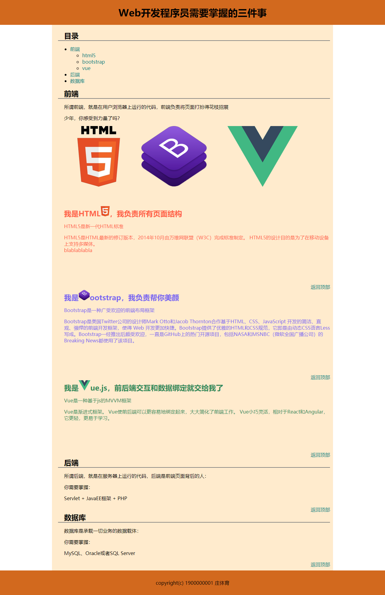

# 要求：制作下面的单个页面 

 
# 具体要求
1. 页面由header，content和footer三块组成。header和footer要求充满整个页面宽度。content宽900px。
2. content头部必须有一块目录，可以通过目录链接到达页面的所有位置。图中目录的写法，可以参考第3章的列表元素。
3. 前端部分三块区域分别用不同颜色的字体介绍对应框架。
4. 每块内容的最下方都应该有返回顶部的链接，可以直接返回顶部。
5. 三个框架的图片点击后可以到达对应的框架介绍。
6. 修改a标签的样式，使其不管是否访问，都显示图中颜色。当鼠标悬停时，底色应该替换成 的颜色。

# 提交要求：
24级网页设计作业02
截止时间：2025-03-13 23:59
提交地址：https://send2me.cn/_ZzZvdfT/T2KdbwfOGdJX5Q
请打包成zip提交，**不要提交文件夹，不要提交文件夹，不要提交文件夹！**
如果作业有问题，重复提交即可，会覆盖旧的提交。
